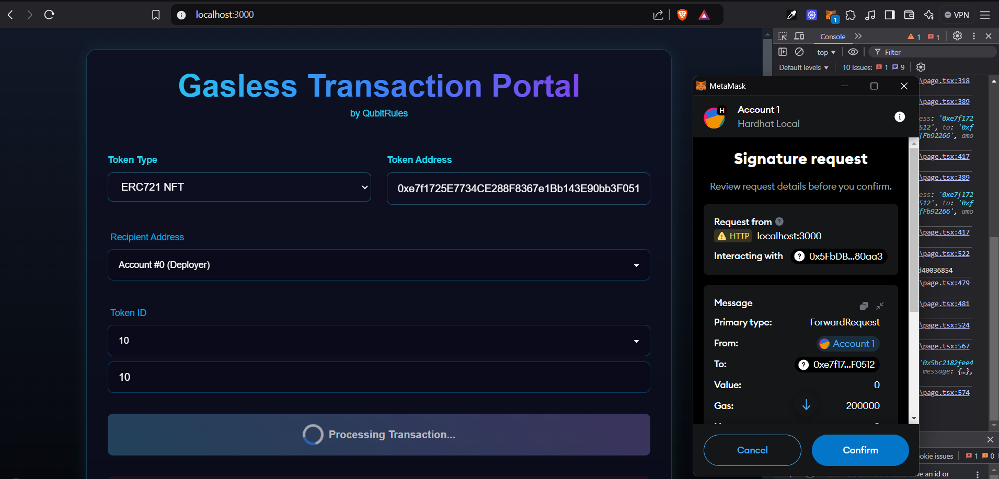

# 🌟 Gasless Transaction Portal

A futuristic web3 application that enables users to perform gasless token transfers for both ERC20 and ERC721 tokens. This project implements meta-transactions using a forwarder contract pattern.

 

## 🚀 Features

- 🔥 **Gasless Transactions**: Users don't need ETH to transfer tokens
- 🎨 **Support for Multiple Token Standards**:
  - ERC20 tokens
  - ERC721 (NFT) tokens
- 🛡️ **Security Features**:
  - EIP-712 signature verification
  - Nonce tracking
  - Blacklist functionality
  - Emergency pause mechanism
- 🎯 **User Features**:
  - Token auto-detection
  - MetaMask integration
  - Real-time transaction status
  - Good-themed UI

## 🏗️ Architecture


## 🛠️ Tech Stack

- **Frontend**: Next.js, TailwindCSS, Framer Motion
- **Smart Contracts**: Solidity, OpenZeppelin
- **Development**: TypeScript, Hardhat
- **Web3**: Ethers.js v6

## 📦 Installation

```bash
# Clone the repository
git clone https://github.com/yourusername/gasless-forwarder.git

# Install dependencies
npm install

# Install frontend dependencies
cd frontend
npm install
```

## ⚙️ Configuration

1. Create `.env` file in root:
```env
PRIVATE_KEY=your_wallet_private_key
SEPOLIA_RPC_URL=your_sepolia_rpc_url
RELAYER_PRIVATE_KEY=your_relayer_private_key
```

2. Create `.env.local` in frontend directory:
```env
NEXT_PUBLIC_FORWARDER_ADDRESS=your_forwarder_contract_address
NEXT_PUBLIC_TEST_TOKEN_ADDRESS=your_test_token_address
RPC_URL=your_rpc_url
```

## 🚀 Deployment

```bash
# Deploy contracts
npx hardhat node

npx hardhat run scripts/deploy.ts --network <network>

# Start frontend
cd frontend
npm run dev
```

## Explanation & Usage
This project demonstrates a gasless transaction forwarder. Users can transfer ERC-20 or ERC-721 tokens without needing to hold ETH:
1. A Forwarder contract collects signed data.
2. A relayer (with ETH) forwards valid calls to the blockchain on users’ behalf.
3. The UI allows specifying token details, performing approval, and sending gasless transfers with EIP-712 signatures.

## Local Deployment
1. Install dependencies:
   ```
   npm install
   ```
2. Start local Hardhat node:
   ```
   npx hardhat node
   ```
3. Deploy contracts:
   ```
   npx hardhat run scripts/deploy.ts --network localhost
   ```
4. Run frontend:
   ```
   cd frontend
   npm run dev
   ```

## 💡 How It Works

1. **User Interaction**:
   - User connects wallet
   - Selects token type (ERC20/ERC721)
   - Enters token and recipient details

2. **Meta-Transaction Flow**:
   ```typescript
   const message = {
     from: userAddress,
     to: tokenAddress,
     value: "0",
     gas: "200000",
     nonce: nonce,
     data: transferData,
     validUntil: expiry
   };
   ```

3. **Signature & Relay**:
   - User signs the structured message
   - Relayer executes the transaction
   - Forwarder verifies and processes

## 🔒 Security

- EIP-712 structured data signing
- Replay attack prevention
- Gas limit controls
- Contract pausability
- Emergency withdrawal functions
- Blacklist functionality

## 🧪 Testing

```bash
# Run contract tests
npx hardhat test

# Run local node
npx hardhat node

# Deploy to local network
npx hardhat run scripts/deploy.ts --network localhost
```

## 📱 UI Features

- Responsive design
- Real-time updates
- Transaction status tracking
- Error handling
- Loading states
- MetaMask integration
- Token auto-detection

## 🛣️ Roadmap

- [ ] Multi-chain support
- [ ] Batch transactions
- [ ] Gas price oracle integration
- [ ] More token standards support
- [ ] Advanced transaction monitoring

## 📄 License

MIT License - see [LICENSE](LICENSE) for details
## 🌐 OurWebsite - https://www.qubitrules.com/
## 🤝 Contributing

Contributions are welcome! Please feel free to submit a Pull Request.

## 📧 Contact

For support or queries, please open an issue or contact [captainempire786@gmail.com](mailto:captainempire786@gmail.com)
